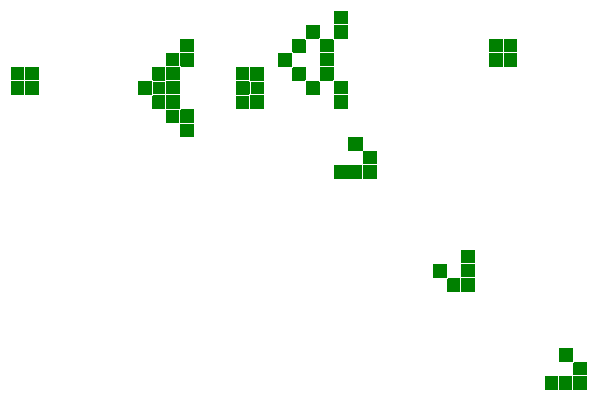

--

# Game of life in React & ES6

This is just an exercise to check some best practices in React 0.13.* using ES6 (babel).

My idea here is to completely isolate logic and presentation and test only the former. It's not good to test presentation since even if it works on a mock DOM or phantom it doesn't guarantee much in terms of device/browser support. This should be delegated to proper integration testing. 

#### Running

Just open the `index.html` in your browser.

#### Compiling

```
npm run build
```

#### Testing

```
npm test
```